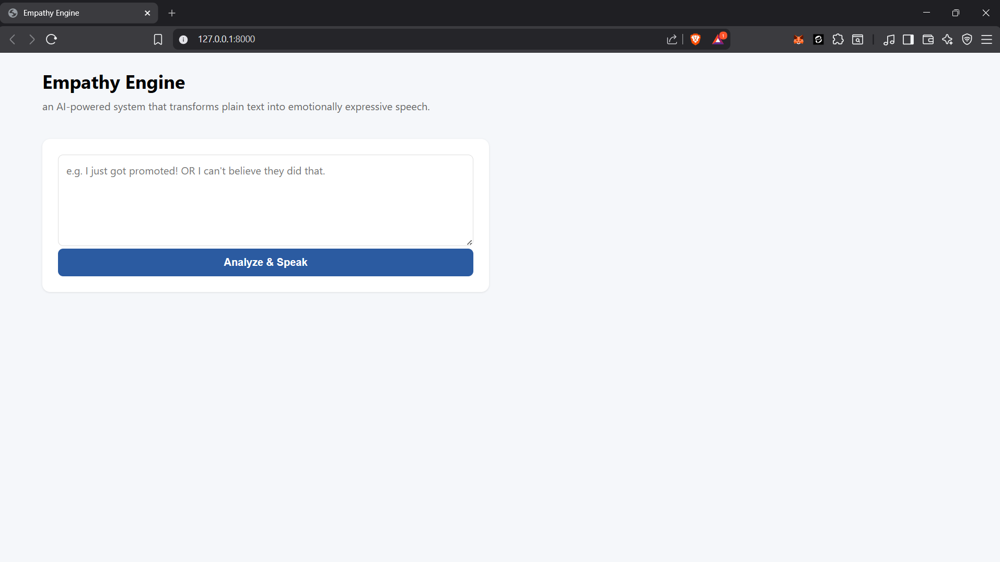
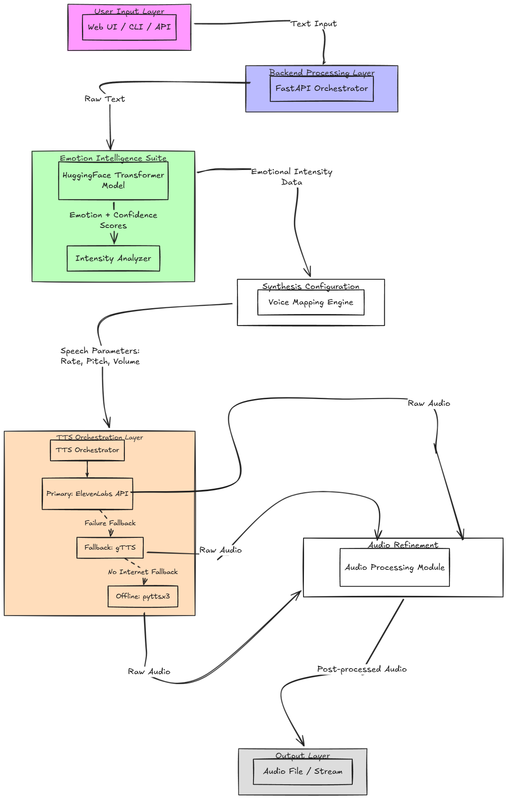
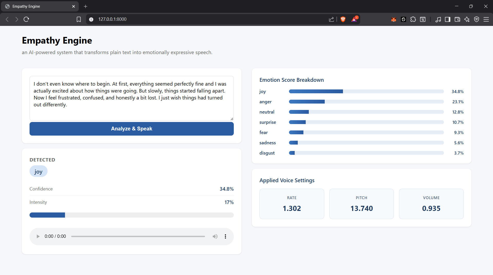

# 🎤 Empathy Engine: Emotion-Aware Text-to-Speech System

## 🚀 Overview

**Empathy Engine** is an AI-powered system that transforms plain text into **emotionally expressive speech**.

Traditional Text-to-Speech (TTS) systems generate monotonous audio. This project enhances that by:

* Detecting **emotion** from text
* Measuring **intensity** of that emotion
* Dynamically adjusting **voice parameters**
* Generating **human-like expressive speech**

---

## 🖥️ Application Preview



## 🎯 Problem Statement

Standard TTS systems lack emotional depth.
This project aims to bridge the gap between:

```text
Text Understanding → Emotional Expression → Human-like Speech
```

---

## 🧠 Key Features

* ✅ Emotion Detection (Transformer-based NLP)
* ✅ Intensity Scoring (Hybrid logic)
* ✅ Emotion-aware Voice Mapping
* ✅ Multi-engine TTS Orchestration
* ✅ ElevenLabs Integration (Primary)
* ✅ Fallback System (gTTS + pyttsx3)
* ✅ Audio Processing (speed, pitch, pauses)
* ✅ Web UI + API support

---

# 🏗️ System Architecture



```text
User Input (Web UI / CLI / API)
        ↓
FastAPI Backend (/analyze, /speak)
        ↓
Emotion Detection (HuggingFace Model)
        ↓
Emotion + Intensity Analyzer
        ↓
Voice Mapping Engine
        ↓
TTS Orchestrator
   ├── ElevenLabs (Primary)
   ├── gTTS (Fallback)
   └── pyttsx3 (Backup)
        ↓
Audio Processing Layer
        ↓
Audio Output (.mp3/.wav)
```

---

# 🧩 Tech Stack

| Layer            | Technology               |
| ---------------- | ------------------------ |
| Backend          | FastAPI                  |
| NLP Model        | HuggingFace Transformers |
| Primary TTS      | ElevenLabs API           |
| Fallback TTS     | gTTS                     |
| Offline TTS      | pyttsx3                  |
| Audio Processing | pydub + FFmpeg           |
| Frontend         | HTML + JS                |
| Language         | Python 3.10              |

---

# 🧠 Approach & Design Thinking

## 1. Emotion Detection

We use a pre-trained transformer model:

```text
j-hartmann/emotion-english-distilroberta-base
```

* Splits text into sentences
* Performs classification
* Aggregates results

📌 Implementation:

---

## 2. Intensity Scoring

We compute emotional intensity using **three signals**:

* Model confidence
* Capitalization ratio
* Punctuation density

```python
intensity = 0.5 * confidence + 0.35 * punctuation + 0.15 * caps
```

Enhancements:

* `!` → increases intensity
* ALL CAPS → increases intensity

📌 Implementation:

---

## 3. Emotion → Voice Mapping (CORE LOGIC)

Each emotion is mapped to:

* Rate (speed)
* Pitch
* Volume

We interpolate between **calm → peak values**:

```python
rate = base_rate + (intensity * 0.3)
pitch = base_pitch + (intensity * 10)
volume = base_volume + (intensity * 0.2)
```

Example:

| Emotion | Behavior             |
| ------- | -------------------- |
| Joy     | Faster, higher pitch |
| Sadness | Slower, lower pitch  |
| Anger   | Faster, sharper tone |
| Neutral | Balanced             |

📌 Implementation:

---

## 4. TTS Orchestration (Resilient Design)

We run multiple engines in parallel:

Priority:

1. ElevenLabs
2. gTTS
3. pyttsx3

If one fails → fallback automatically.

📌 Implementation:

---

## 5. Audio Processing Layer

After TTS generation:

* Speed adjustment
* Pitch shifting
* Volume normalization
* Pause injection

📌 Implementation:

---

# 📦 Project Structure

```text
Empathy/
│
├── app/
│   ├── main.py
│   ├── emotion_detector.py
│   ├── intensity_scorer.py
│   ├── voice_mapper.py
│   ├── tts_orchestrator.py
│   ├── audio_processor.py
│
├── templates/
│   └── index.html
│
├── cli.py
├── .env
├── requirements.txt
└── README.md
```

---

# ⚙️ Setup Instructions

## 1. Clone Repository

```bash
git clone https://github.com/Ramprakash852/Empathy-Engine.git
cd Empathy
```

---

## 2. Create Virtual Environment

```bash
python -m venv venv
venv\Scripts\activate
```

---

## 3. Install Dependencies

```bash
pip install -r requirements.txt
```

---

## 4. Setup Environment Variables

Create `.env` file:

```env
ELEVENLABS_API_KEY=your_api_key_here
```

---

## 5. Run Application

```bash
uvicorn app.main:app --reload
```

---

## 6. Open UI

```text
http://127.0.0.1:8000
```

---

## 🧪 Testing Examples

### Example Input
"I don’t even know where to begin. At first, everything seemed perfectly fine and I was actually excited about how things were going. But slowly, things started falling apart. Now I feel frustrated, confused, and honestly a bit lost. I just wish things had turned out differently."

### Output Visualization




### Joy

```text
I just got promoted today!!!
```

### Sadness

```text
I feel really low and tired...
```

### Anger

```text
This is completely unacceptable!
```

---

# 📊 Sample Output

```json
{
  "emotion": "joy",
  "confidence": 0.91,
  "intensity": 0.87,
  "engine": "elevenlabs",
  "voice_params": {
    "rate": 1.32,
    "pitch": 15.2,
    "volume": 0.95
  }
}
```

---

# ⚠️ Challenges Faced

## 1. ElevenLabs API Restrictions

* Free-tier limitations
* Voice restrictions
* Abuse detection

👉 Solution:

* Implemented fallback system
* Designed resilient architecture

---

## 2. Environment Variable Issues

* `.env` not loading in subprocess
  👉 Fixed via path-based loading

---

## 3. Dependency Issues

* NumPy compatibility with PyTorch
  👉 Resolved with version control

---

# 🔥 What Makes This Unique

* Emotion-aware speech synthesis
* Hybrid ML + rule-based system
* Multi-engine resilient architecture
* Real-world failure handling

---

# 🧠 Engineering Decisions

* Used ElevenLabs for high-quality speech
* Added fallback system for reliability
* Designed modular pipeline for scalability

---

# 🚀 Future Improvements

* Emotion-specific voice styles
* Real-time streaming
* Voice cloning
* Frontend enhancement

---

# 🏁 Conclusion

Empathy Engine enhances AI communication by making speech:

```text
More human, expressive, and emotionally aware
```

---

## 👨‍💻 Author

Bhukya Ramprakash